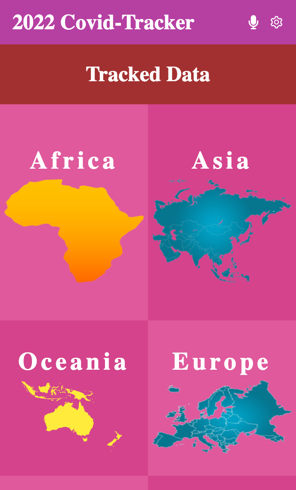

# Metrics webApp

Covid 19 Data is a tracking site that provides the necessary information on covid 19 cases in any African country and their update

> || Desktop  || Mobile||
> ||----------||-------||
> || || ||

Additional description about the project and its features.

## Built With

- API, ReactJS & Redux.

## Live Demo

[See Demo]()

## Presentation Video

[See Video]()

# Authors

GitHub: [Jos Kalenda](https://www.linkedin.com/in/jos-kalenda/)
Twitter: [Jos Kalenda](https://twitter.com/JosKalenda)
LinkedIn: [Jos Kalenda](https://github.com/JosKalenda)

### `npm start`
Runs the app in the development mode
### `npm test`
Launches the test runner in the interactive watch mode
### `npm run build`

Builds the app for production to the `build` folder.\
It correctly bundles React in production mode and optimizes the build for the best performance.

# Acknowledgment

- [Nelson Sakwa](https://www.behance.net/sakwadesignstudio) the [author of the original design](https://www.behance.net/gallery/31579789/Ballhead-App-(Free-PSDs)), as required by the [Creative Commons License](https://creativecommons.org/licenses/)

Contributions, issues, and feature requests are welcome!

Feel free to check the issues page.

Show your support
Give a ⭐️ if you like this project!

📝 License
This project is MIT licensed