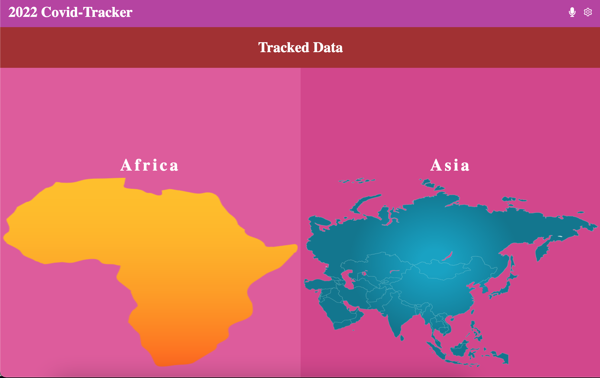
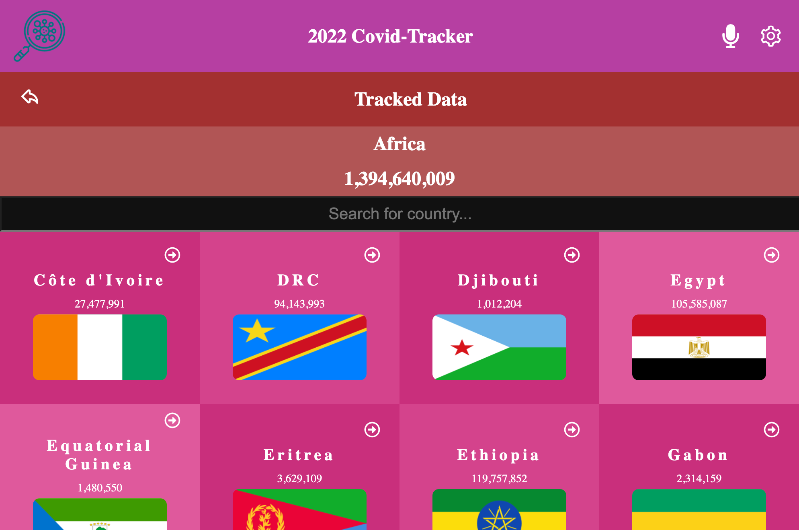
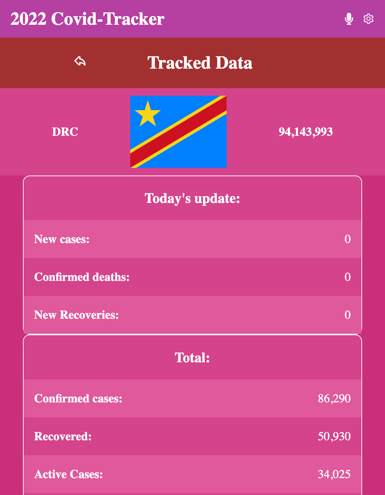
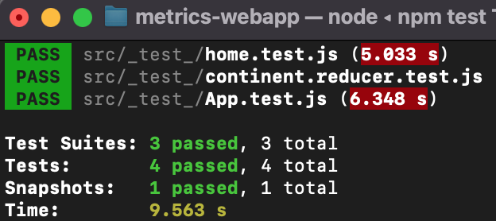

# Metrics webApp

Covid 19 Data is a tracking site that provides the necessary information on covid 19 cases in any African country and their update

## Projects Details

> |-|  Continents  |-| Countries |-|
> |-|--------------|-|-----------|-|
> |-|  |-| 

> |-| Country detail |-| Testing   |-|
> |-|----------------|-|-----------|-|
> |-|  |-|  |-|

Additional description about the project and its features.

## Built With

- API
- ReactJS & Redux.

## Live Demo

[See Demo](https://metrics-app-jos.netlify.app/)

## Presentation Video

[See Video](https://www.loom.com/share/1ba8b442a6f6449083f6a8c03e5f648e)

# Authors

👤 **Jos Kalenda**

- GitHub: [Jos Kalenda](https://www.linkedin.com/in/jos-kalenda/)
- Twitter: [Jos Kalenda](https://twitter.com/JosKalenda)
- LinkedIn: [Jos Kalenda](https://github.com/JosKalenda)


```bash

$ npm i #install dependencies
$ npm start # Runs the app in the development mode
$ npm test #Launches the test runner in the interactive watch mode

```

## Acknowledgment

- [Nelson Sakwa](https://www.behance.net/sakwadesignstudio) the [author of the original design](https://www.behance.net/gallery/31579789/Ballhead-App-(Free-PSDs)), as required by the [Creative Commons License](https://creativecommons.org/licenses/)

## 🤝 Contributing

Contributions, issues, and feature requests are welcome!

Feel free to check the [issues page](https://github.com/joskalenda/metrics-webapp/issues).

## Show your support

Give a ⭐️ if you like this project!

## 📝 License

This project is [MIT](https://opensource.org/licenses/MIT) licensed.